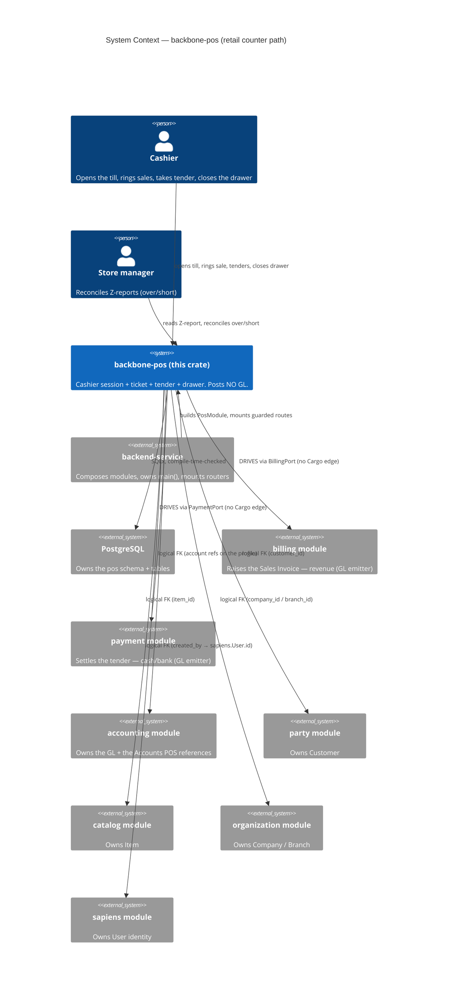
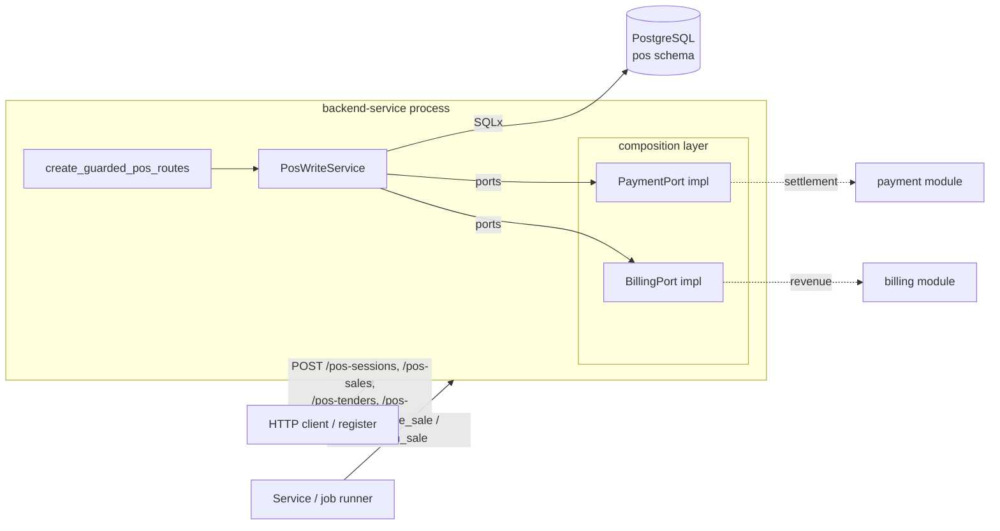
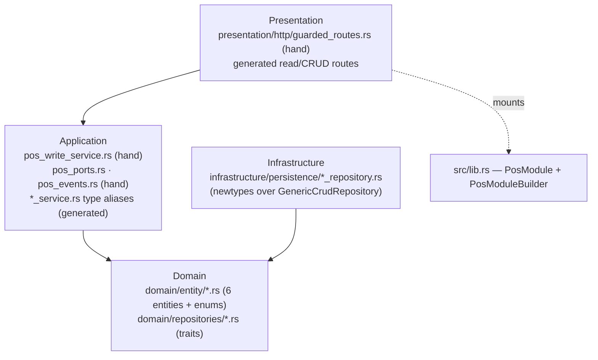

<!-- Reader: Maintainer · Mode: Explanation -->
# Architecture

`backbone-pos` is the **retail counter path of an Indonesia-first ERP's Financials pillar**. It is a
**library crate** that owns one bounded domain — the cashier session, the counter ticket, tender, and
the drawer — as four DDD layers. It does not run on its own: a `backend-service` composes it, hands it
a database pool, and mounts its router. Its defining move is that **it posts no general ledger (GL)
itself** — on recognition it *orchestrates* two downstream emitters, `backbone-billing` (revenue) and
`backbone-payment` (settlement), through outbound ports, so retail reuses the same GL posts as web/B2B
sales. This page shows the system top-down (C4), then traces the retail seam end to end.

## 1. Context

Who uses the module, what it drives, and what it references.



*What to notice: **POS posts no GL — it orchestrates two emitters through ports.** Billing and payment
are reached through the `BillingPort`/`PaymentPort` traits, so the shipped library has **no normal
Cargo edge** to either (dev-deps only, for the seam test); a composition layer supplies the real
implementations. Everything else — account, customer, item, company/branch, identity — is a **logical
FK** (`@exclude_from_foreign_key_check`, no DB constraint), a sibling module referenced by id, never a
copied-in table.*

## 2. Containers

The module compiles into the service binary; there is no separate POS process. The recommended mount
is the **guarded surface**: read documents plus validated writes.



*What to notice: **generic CRUD mutation is NOT mounted on the guarded surface.** The four write routes
go through `PosWriteService`, which computes money server-side, so a caller cannot POST a ticket with
inconsistent totals or reopen a closed session. `recognize_sale`/`return_sale` need the ports, so they
are **service/job-driven, not HTTP routes** — they reach out through `BillingPort`/`PaymentPort` to the
composition layer. The full 12-endpoint CRUD surface (`PosModule::all_crud_routes()`) exists but is
unguarded — trusted/admin/seeding only.*

## 3. Components / modules — the DDD 4-layer shape

Dependencies point **inward only**. Domain depends on nothing. What's different here from a stock
skeleton module is the **hand-authored write path** layered over the generated CRUD.



*What to notice: the arrows still point inward, but the **application layer carries hand-authored
code** — `PosWriteService`, `pos_ports`, `pos_events` — alongside the generated type-alias services.
That hand-authored code is the domain logic the schema can't express.*

| Layer | Directory | Holds (real POS) | Origin | May depend on |
|-------|-----------|------------------|--------|---------------|
| **Domain** | `src/domain/` | 6 entities — `PosProfile`, `PosOpeningEntry`, `PosInvoice`, `PosInvoiceItem`, `PosPayment`, `PosClosingEntry` — plus enums `PosSessionStatus`, `PosInvoiceStatus`, `PosPaymentMethod`, `PosClosingStatus`, and the repository **traits** (ports) | generated | nothing |
| **Application** | `src/application/` | Generated CRUD services as **type aliases** over `GenericCrudService` (`PosInvoiceService`, `PosProfileService`, …); **hand-authored** `pos_write_service.rs` (`PosWriteService`), `pos_ports.rs` (`BillingPort`/`PaymentPort`), `pos_events.rs` (`PosEvent`/`PosEventSink`) | generated **+ user-owned** | domain |
| **Infrastructure** | `src/infrastructure/` | Repository **newtypes** over `GenericCrudRepository<Entity, PgPool>` (`PosInvoiceRepository`, …) | generated | domain |
| **Presentation** | `src/presentation/` | Generated read/CRUD routes per entity; **hand-authored** `http/guarded_routes.rs` (`create_guarded_pos_routes`, the four validated write routes) | generated **+ user-owned** | application |
| **Composition** | `src/lib.rs` | **`PosModule` / `PosModuleBuilder`** — wires the 6 CRUD services, exposes `all_crud_routes()` | hand-owned root | all layers |

**Where the composition root lives.** Build the module from **`PosModule` in `src/lib.rs`**
(`PosModule::builder().with_database(pool).build()?`). This is the single composition root; there is no
separate `module.rs`.

**Generated CRUD vs. the hand-authored write path.** Every entity gets the twelve generic endpoints
(`list` · `create` · `get` · `update` · `patch` · `soft_delete` · `restore` · `empty_trash` ·
`bulk_create` · `upsert` · `find_by_id` · `list_deleted`) for free, via `BackboneCrudHandler`. In POS
those are used **mostly for reads** — the guarded surface mounts only the read routes from CRUD and
adds four *validated* write routes backed by `PosWriteService`. The generic mutation endpoints would let
a caller write an internally-inconsistent ticket, so production keeps them off the mounted router.

## 4. Data & control flow — the retail recognition seam, end to end

This is the marquee path: a cash sale rung, tendered, and **recognised** — POS driving billing then
payment so the same GL posts happen as any other sale.

```mermaid
sequenceDiagram
    actor Cashier
    participant W as PosWriteService
    participant DB as PostgreSQL (pos schema)
    participant B as BillingPort
    participant P as PaymentPort

    Cashier->>W: ring_sale(NewSale)
    Note over W: server-side money —<br/>net = money(qty·price) − discount<br/>grand = net + tax<br/>rounded = IDR round_to(grand, step)
    W->>DB: INSERT pos_invoices (status=draft) + items
    W-->>Cashier: pos_invoice_id (draft)

    Cashier->>W: add_tender(id, method, amount)
    Note over W: paid_total = Σ tenders<br/>change_due = max(0, paid − rounded)<br/>fully_tendered = paid ≥ rounded
    W->>DB: INSERT pos_payments; UPDATE paid_total, change_due
    W-->>Cashier: TenderOutcome

    Cashier->>W: recognize_sale(id, billing, payment)
    Note over W: require fully-tendered draft + register accounts
    W->>B: raise_and_post (Dr A/R · Cr Revenue)
    B-->>W: InvoiceAck { invoice_id }
    W->>DB: UPDATE billing_invoice_id WHILE STILL draft
    W->>P: settle rounded_total (Dr Cash · Cr A/R)
    P-->>W: SettlementAck { payment_id }
    W->>DB: UPDATE status draft→paid (gated)
    W-->>Cashier: RecognizeOutcome
    Note over W: emit PosInvoicePaid (once)
```

*What to notice: for a **cash sale A/R nets to zero at the counter** — billing books `Dr A/R · Cr
Revenue`, payment books `Dr Cash · Cr A/R`, and the receivable cancels. Billing is raised
**at-most-once**: `billing_invoice_id` is persisted on the **still-draft** ticket the instant
`raise_and_post` returns, so a decline-then-retry (declined card, closed period) **reuses** that
invoice instead of raising a second one — the counter's ordinary retry does **not double the revenue
journal** (IP-4). The `draft→paid` transition is gated by a conditional UPDATE, so `PosInvoicePaid`
fires exactly once even if `recognize_sale` is replayed (it short-circuits on `paid`).*

**Closing the drawer (`close_session`).** For each tender method, `expected = opening_float + Σ
recognised tenders` (cash also `− Σ change_due`); `difference = counted − expected`; `difference_total
= Σ over/short`. The service persists the per-method breakdown as the **Z-report** (`PosClosingEntry`,
status `submitted`), marks the session `closed`, and emits `PosSessionClosed`. The store manager reads
that report to reconcile.

**Returns (`return_sale`).** A return **reverses both legs**: payment refunds (`Dr A/R · Cr Cash`) and
billing raises a credit note (`Dr Revenue · Cr A/R`, invoice → cancelled), so revenue, cash, and A/R
**all net back to zero** (RSSEAM-2). It records an `is_return` ticket linked via `return_against`,
flips the original `paid→returned` (gated, so at-most-once), and emits `PosInvoiceReturned`. Both
downstream reversals are idempotent; full-ticket only (line-level returns are a non-goal).

## Where persistence semantics come from

- **Soft delete** is structural: `config.soft_delete: true` in
  [`index.model.yaml`](../../schema/models/index.model.yaml) → every live-row query filters
  `(metadata->>'deleted_at') IS NULL`, and `soft_delete`/`restore`/`empty_trash`/`list_deleted` operate
  on `metadata.deleted_at`.
- **Audit** (`config.audit: true`) → the `metadata` JSONB column carrying `created_at`, `updated_at`,
  `deleted_at`, `created_by`, `updated_by`, `deleted_by`. Timestamps are set by a **Postgres trigger**
  ([`20260426220009_add_audit_triggers.up.sql`](../../migrations/20260426220009_add_audit_triggers.up.sql)),
  not by Rust — so stamps hold even for writes that bypass a service. The `*_by` actor fields are
  logical FKs to `sapiens.User.id`.
- **Own schema** → tables are qualified `pos.<table>` (`pos.pos_invoices`, `pos.pos_payments`, …), so
  POS never collides with a sibling module on a table name.

## Key decisions

- [ADR-001 — POS boundary and the retail seam](../adr/ADR-001-pos-boundary-and-retail-seam.md) — why POS
  posts no GL and instead orchestrates billing + payment through ports (this module's own decision
  record).
- [ADR-0001](adr/adr-0001-schema-yaml-ssot.md) — schema YAML is the single source of truth.
- [ADR-0002](adr/adr-0002-generic-crud.md) — services/repositories are generic, inherited not written.
- [ADR-0003](adr/adr-0003-custom-markers.md) — regen-safety via CUSTOM markers and `user_owned`.

The seam is **executable proof**, not prose: [`tests/retail_sale_seam.rs`](../../tests/retail_sale_seam.rs)
drives a 100,000 cash sale across POS ↔ billing ↔ payment ↔ accounting (A/R nets to 0, revenue
−100,000, cash 100,000) and a return that reverses both legs back to zero.

---

Next: [Maintainer Guide](05-maintainer-guide.md) — how to add a feature without breaking the machine.
